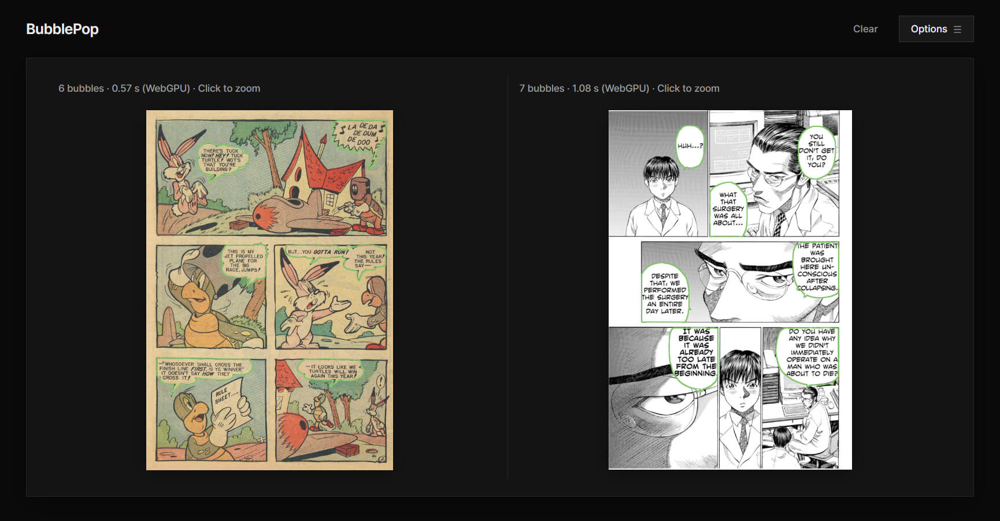

# BubblePop

A lightweight manga, comics speech bubble extraction model.

Highlights:

- Lightweight, 0.93M parameters, 1.8 MB FP16 weights
- Quick, ~110ms CPU (~40ms GPU) inference latency on Qualcomm Snapdragon 845
- Distilled from [SAM 3.1](https://huggingface.co/facebook/sam3.1)

[Click here](https://letmutex.github.io/bubble-pop/) to check online demo.



## Usages

1. Prepare

```bash
git clone https://github.com/letmutex/bubble-pop
cd bubble-pop
uv pip install "torch>=2.6" torchvision numpy opencv-python onnx
```

2. PyTorch inference

```bash
uv run inference.py web-demo/assets/page-1.jpg --output overlay.jpg
```

3. Export

```bash
# ONNX FP16
uv run export.py model.pt --format onnx-fp16 --output model_fp16.onnx

# ONNX FP16 for Wasm (float32 I/O)
uv run export.py model.pt --format onnx-fp16-wasm --output web-demo/assets/model.onnx

# TFLite FP16
uv pip install "onnx2tf[tensorflow]==2.6.8"
uv run export.py model.pt --format tflite-fp16 --output model_fp16.tflite
```

## Bindings

[Kotlin (Android)](./library/kotlin)

## Model info

| Property | Details |
| :--- | :--- |
| Architecture | UNet |
| Backbone | MobileNetV3-Small |
| Parameters | 0.93M |
| Input | Grayscale, 768 × 1024 |
| Output | 3-channel logits (`mask`, `boundary`, `confidence`) |

## Training

**Pre-training:** This model is pre-trained on ~12K Web comics/manga pages; distilled directly from [SAM 3.1](https://huggingface.co/facebook/sam3.1)'s outputs.

**Fine-tuning:** The best pre-trained checkpoint is fine-tuned using ~2.4K synthetic pages of hard-samples.

## Limitations

The current version of the model may not perform well in the following cases:

- Transparent bubble, model may fail to detect them
- Thin/long bubble tails, model may fail to detect the full tail

## Acknowledgements

- [SAM 3.1](https://huggingface.co/facebook/sam3.1)
- [MobileNetV3](https://research.google/blog/introducing-the-next-generation-of-on-device-vision-models-mobilenetv3-and-mobilenetedgetpu/)
- [PicoSAM3](https://github.com/pbonazzi/picosam3)

## License

[Apache License 2.0](https://www.apache.org/licenses/LICENSE-2.0.txt)
